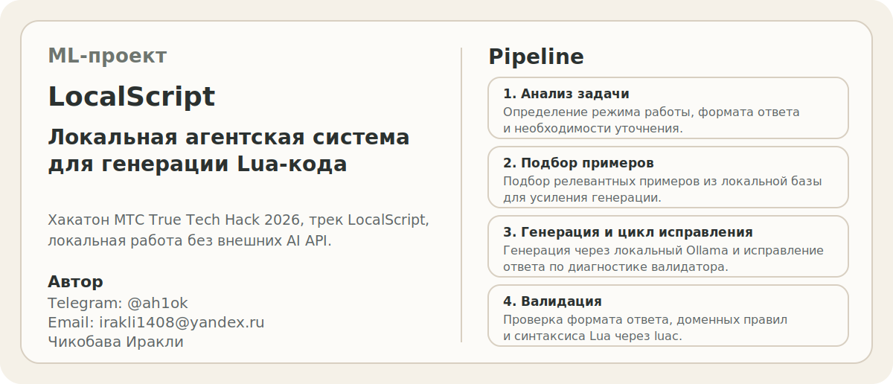

# LocalScript

<p align="center">
  
</p>

ML-проект, выполненный в рамках хакатона **МТС True Tech Hack 2026** в треке **LocalScript: локальная агентская система для генерации Lua-кода (платформа MWS Octapi)**.

Официальная страница хакатона: [True Tech Hack 2026](https://truetecharena.ru/contests/true-tech-hack2026#overview)

В проекте реализована автономная локальная агентская система, которая принимает задачу на русском или английском языке, определяет сценарий работы, подбирает релевантные примеры, генерирует Lua-код через локальную LLM и валидирует результат без отправки данных во внешние AI-сервисы.

## Что сделано

- реализован `FastAPI`-сервис с маршрутами `/analyze`, `/generate`, `/validate`, `/health`;
- добавлен слой анализа задачи, который определяет режим `generate` или `modify`, формат ответа и необходимость уточнения;
- собран локальный retrieval по базе примеров из `data/few_shot_examples.json`;
- реализована валидация артефакта по формату ответа, доменным правилам и синтаксису Lua через `luac`;
- добавлен цикл автоматического исправления: при ошибках генерации система повторно исправляет ответ по диагностике валидатора;
- подготовлен полностью локальный запуск через `Docker Compose` c `Ollama` и моделью `qwen2.5-coder:7b`;
- добавлен скрипт регрессионной проверки для публичных и синтетических кейсов.

## Pipeline

Пайплайн обработки запроса:

`analyze -> clarify_or_generate -> validate -> repair -> return`

Что происходит внутри:

1. Анализируется задача, доступный контекст и ожидаемый формат результата.
2. При необходимости система просит уточнение или переключается в режим модификации существующего кода.
3. Для генерации подбираются релевантные примеры из локальной базы.
4. Код генерируется через локальный `Ollama`.
5. Результат проверяется валидатором и синтаксическим разбором через `luac`.
6. Если обнаружены ошибки, агент запускает цикл исправления и возвращает исправленный артефакт.

## Архитектура репозитория

- `app/main.py` - HTTP API и контракт запросов;
- `app/llm.py` - анализ задачи, выбор режима, генерация, запрос уточнения и цикл исправления;
- `app/retrieval.py` - локальный retrieval и подбор примеров;
- `app/validator.py` - форматная, доменная и синтаксическая валидация;
- `data/few_shot_examples.json` - база локальных примеров для retrieval;
- `data/localscript-openapi.yaml` - базовый контракт организаторов;
- `scripts/run_public_regression.py` - прогон регрессионных кейсов;
- `eval/` - публичные и синтетические наборы кейсов;
- `hackaton.ipynb` - ноутбук с базовыми экспериментами.

## Стек

- Python
- FastAPI
- Ollama
- qwen2.5-coder:7b
- Docker Compose
- Lua 5.4 / `luac`

## Модель и параметры

По умолчанию используется:

- `LOCALSCRIPT_MODEL=qwen2.5-coder:7b`

Параметры инференса:

- `num_ctx=4096`
- `num_predict=256`
- `temperature=0`
- `seed=42`
- `OLLAMA_NUM_PARALLEL=1`

Эти параметры задаются через `docker-compose.yml` и `app/llm.py`.

## Быстрый запуск

Требования:

- Docker Desktop или Docker Engine + Compose
- локальная среда, в которой доступен запуск `Ollama`
- GPU для сценария, близкого к проверке организаторов

Запуск:

```bash
docker compose up --build
```

Что происходит при старте:

1. Поднимается контейнер `ollama`.
2. Контейнер `ollama-init` подтягивает модель `qwen2.5-coder:7b`.
3. После этого стартует приложение `app`.

Запуск в фоне:

```bash
docker compose up --build -d
```

## Проверка после запуска

Проверка health-endpoint:

```bash
curl http://localhost:8080/health
```

Пример анализа задачи:

```bash
curl -X POST http://localhost:8080/analyze \
  -H "Content-Type: application/json" \
  -d '{
    "prompt": "Из полученного списка email получи последний.",
    "context": {
      "wf": {
        "vars": {
          "emails": ["user1@example.com", "user2@example.com", "user3@example.com"]
        }
      }
    }
  }'
```

Пример генерации:

```bash
curl -X POST http://localhost:8080/generate \
  -H "Content-Type: application/json" \
  -d '{
    "prompt": "Из полученного списка email получи последний.",
    "context": {
      "wf": {
        "vars": {
          "emails": ["user1@example.com", "user2@example.com", "user3@example.com"]
        }
      }
    },
    "target_output_format": "raw_lua"
  }'
```

Пример модификации существующего кода:

```bash
curl -X POST http://localhost:8080/generate \
  -H "Content-Type: application/json" \
  -d '{
    "prompt": "Доработай код и добавь поле squared.",
    "existing_code": "{\"num\":\"lua{return tonumber('\''5'\'')}lua\"}",
    "target_output_format": "json_with_lua_fields"
  }'
```

Пример валидации:

```bash
curl -X POST http://localhost:8080/validate \
  -H "Content-Type: application/json" \
  -d '{
    "prompt": "Отфильтруй элементы из массива, чтобы включить только те, у которых есть значения в полях Discount или Markdown.",
    "output": "local result = _utils.array.new() return result",
    "expected_output_format": "raw_lua"
  }'
```

## Regression

Публичная выборка:

```bash
docker compose exec app python scripts/run_public_regression.py
```

Синтетические кейсы:

```bash
docker compose exec app python scripts/run_public_regression.py --cases eval/synthetic_cases_v2.json --request-timeout-seconds 420
```

## Локальность и безопасность

- внешние AI API не используются;
- генерация выполняется только через локальный `Ollama`;
- retrieval работает только по локальной базе примеров;
- данные и код не отправляются во внешние сервисы;
- синтаксическая проверка выполняется локально через `luac`.

## Что показывает проект

Этот репозиторий демонстрирует навыки:

- сборки локального LLM-приложения без внешних AI API;
- проектирования агентного пайплайна вокруг модели, а не только одного prompt;
- построения retrieval + validation + repair flow;
- упаковки сервиса в `Docker Compose`;
- разработки прикладного API для генерации и проверки кода.

## Что можно улучшить

- расширить базу примеров под большее число кейсов;
- добавить более формальную офлайн-оценку качества генерации;
- подготовить C4-диаграммы и короткое демо;
- зафиксировать замеры по времени ответа и потреблению ресурсов на целевом железе.
